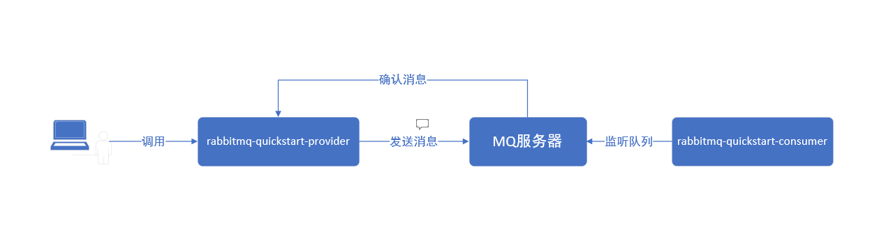
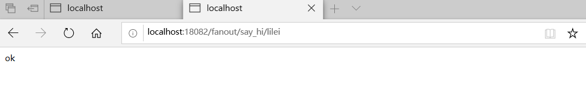
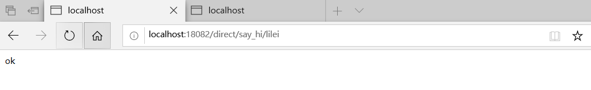

## 快速入门

快速入门通过一个Hello World的示例, 向大家展示一个简单MQ程序开发. 该示例包含两个服务:       
* **rabbitmq-quickstart-provider** 提供发送消息的RESTful服务. 
* **rabbitmq-quickstart-consumer** 监听队列,自动获取消息.     

运行流程为:  


### 示例编译运行

**前置条件:**   

* 已安装JDK 8+
* 已安装Maven 3.x
* 已安装RabbitMQ服务器

执行以下命令:     

```bash
#  解压
tar -xvf rabbitmq-quickstart.tar && cd rabbitmq-quickstart
# 编译
mvn clean package
# 启动 provider
java -jar rabbitmq-quickstart-provider/target/rabbitmq-quickstart-provider-1.0.0.jar &
# 启动 consumer
java -jar rabbitmq-quickstart-consumer/target/rabbitmq-quickstart-consumer-1.0.0.jar &
```

启动完成后,

在浏览器中输入地址http://localhost:18082/send/fanout/say_hi 可以看到



在浏览器中输入地址http://localhost:18082/send/direct/say_hi 可以看到



然后rabbitmq-quickstart-consumer程序的控制台中会打印如下格式的数据：

```
接收到消息:[{"createTime":"2020-04-22 15:42:41","messageData":"test  message, hello! from direct pattern","messageId":"c06f8252-8c3e-4259-9b53-6eed2850d74f"}]
```


### 示例说明

#### rabbitmq-quickstart-provider说明     

**1. pom依赖**     

在pom.xml中增加以下xml片段, 为了可以依赖EOS Microservices的SDK 、starter-amqp组件、fastjson组件、lombok组件            
```xml
<dependencies>
    <dependency>
        <groupId>com.primeton.eos</groupId>
        <artifactId>eos-dap-sdk-starter</artifactId>
    </dependency>
    <dependency>
        <groupId>org.springframework.boot</groupId>
        <artifactId>spring-boot-starter-amqp</artifactId>
    </dependency>
    <dependency>
        <groupId>com.alibaba</groupId>
        <artifactId>fastjson</artifactId>
        <version>1.1.23</version>
    </dependency>
    <dependency>
        <groupId>org.projectlombok</groupId>
        <artifactId>lombok</artifactId>
    </dependency>
</dependencies>


```

**2. 应用配置**    

在应用的配置文件中(src/main/resources/application.yml)增加以下配置

```properties
server:
  port: 18082    # 应用端口

spring:
  main:
    allow-bean-definition-overriding: true
  application:
    name: RABBITMQ-QUICKSTART-PROVIDER
  rabbitmq:
    host: ****
    virtual-host: /****
    port: 32002
    username: ****
    password: ****
    publisher-confirms: true
    
# Eureka settings 
eureka:
  client:
    enabled: false    #close eureka client
    
# SDK settings
eos:
  application:
    sys-code: CCMS    # 系统编码
    sys-key: 0176c8bde0b14ca0ae769454187c9b38    # 系统凭证, 用于统一系统内应用之间互调的凭证 


```


**3. 日志配置**     

在应用的日志配置文件中(src/main/resources/logback-spring.xml)增加以下配置     

```xml
<?xml version="1.0" encoding="UTF-8"?>
<configuration>
    <property name="LOG_FILE" value="./target/eos-app.log"/>
    <property name="EOS_TRACE_LOG_FILE" value="./target/eos-trace.log"/>
    <include resource="com/primeton/eos/dap/sdk/logging/logback/logback-spring.xml" />
</configuration>
```
日志分为2类:     
* eos-app.log: 应用日志, 由应用开发人员使用标准的SLF4J的日志接口记录日志     
* eos-trace.log: 跟踪日志, 由SDK自动记录, 会在以下几个点记录日志     
   * HttpServletFilter 收到请求、发送响应     
   * 执行 Hystrix Command 前后
   * RestTemplate 发送请求、收到响应
   * Feign 发送请求、收到响应 


**4. 应用的启动类**     

```java
@SpringBootApplication
public class ProviderApplication {
	public static void main(String[] args) {
		SpringApplication.run(ProviderApplication.class, args);
	}
}

```

**5. 逻辑实现 SendMessageController**     

```java
@RestController
@RequestMapping(value ="/send",produces = MediaType.APPLICATION_JSON_UTF8_VALUE)
public class SendMessageController {

	@Value("${say-hi-format:privoder say hi to '%s'!}")
	private String sayHiFormat;
	
	@Autowired
	private  RabbitTemplate rabbitTemplate;  //使用RabbitTemplate,这提供了接收/发送等等方法
 
	@GetMapping("/direct/say_hi/{name}")
    public String sendDirectMessage(@PathVariable("name") String name) {
        String messageId = String.valueOf(UUID.randomUUID());
        String messageData = String.format(sayHiFormat, name);
        String createTime = LocalDateTime.now().format(DateTimeFormatter.ofPattern("yyyy-MM-dd HH:mm:ss"));
       
        Map<String,Object> map=new HashMap<>();
        map.put("messageId",messageId);
        map.put("messageData",messageData);
        map.put("createTime",createTime);
        
		CorrelationData correlationData = new CorrelationData(DirectRabbitConfig.DIRECT_EXCHANGE_NAME + UUID.randomUUID().toString());

        rabbitTemplate.convertAndSend(DirectRabbitConfig.DIRECT_EXCHANGE_NAME, DirectRabbitConfig.ROUTING_KEY, JSON.toJSONString(map),correlationData);
        return "ok";
    }
    
	@GetMapping("/fanout/say_hi/{name}")
    public String sendFanoutMessage(@PathVariable("name") String name) {
        String messageId = String.valueOf(UUID.randomUUID());
        String messageData = String.format(sayHiFormat, name);
        String createTime = LocalDateTime.now().format(DateTimeFormatter.ofPattern("yyyy-MM-dd HH:mm:ss"));
       
        Map<String,Object> map=new HashMap<>();
        map.put("messageId",messageId);
        map.put("messageData",messageData);
        map.put("createTime",createTime);
		
        CorrelationData correlationData = new CorrelationData(FanoutRabbitConfig.FANOUT_EXCHANGE_NAME + UUID.randomUUID().toString());
        
    	rabbitTemplate.convertAndSend(FanoutRabbitConfig.FANOUT_EXCHANGE_NAME, null, JSON.toJSONString(map),correlationData);
        return "ok";
    }
}
```

#### rabbitmq-quickstart-consumer说明
eos-dap-quickstart-consumer和eos-dap-quickstart-provider的主要差别在于 `application.yml` 的不同, 其他如`pom.xml`, `logback-spring.xml`没有差别

**1. pom依赖**    

和`rabbitmq-quickstart-provider`的pom依赖一致

**2. 应用配置**    

在应用的配置文件中(src/main/resources/application.yml)增加以下配置

```properties
server:
  port: 18082    # 应用端口

spring:
  main:
    allow-bean-definition-overriding: true
  application:
    name: RABBITMQ-QUICKSTART-CONSUMER
  rabbitmq:
    host: ****
    virtual-host: /****
    port: 32002
    username: ****
    password: ****
    listener:
      simple:
        acknowledge-mode: manual     #手动 ack
        auto-startup: true
        default-requeue-rejected: false #禁止重入队列
        concurrency: 1    #消费者的最小数量
        max-concurrency: 8    #消费者的最大数量
        prefetch: 1    # 从队列每次取一个
        retry:
          enabled: false #关闭重试
          max-attempts: 3
          initial-interval: 10000
    
# Eureka settings 
eureka:
  client:
    enabled: false    #close eureka client
    
# SDK settings
eos:
  application:
    sys-code: CCMS    # 系统编码
    sys-key: 0176c8bde0b14ca0ae769454187c9b38    # 系统凭证, 用于统一系统内应用之间互调的凭证 


```


**3. 逻辑实现 MQConsumer**     

```java
@Slf4j
@Component
public class MQConsumer {

    @RabbitListener(queues = "test_fanout_queue")
	public void receiveFanoutMessage(String receiveMessage, Message message, Channel channel) throws Exception {
    	log.info("接收到消息:[{}]", receiveMessage);
    	channel.basicAck(message.getMessageProperties().getDeliveryTag(), false);
	}
    
    @RabbitListener(queues = "test_direct_queue")
   	public void receiveDirectMessage(String receiveMessage, Message message, Channel channel) throws Exception {
       	log.info("接收到消息:[{}]", receiveMessage);
       	channel.basicAck(message.getMessageProperties().getDeliveryTag(), false);
   	}
}

```
该类为客户端监听队列的核心代码， 通过`RabbitListener(queues = "xxx")` 指定要监听的队列
**⚠️注意** 如果配置中开始手动确认，则在处理完业务逻辑后，一定要进行确认操作，否则会对数据重复消费，影响业务进行和资源浪费。

​    


