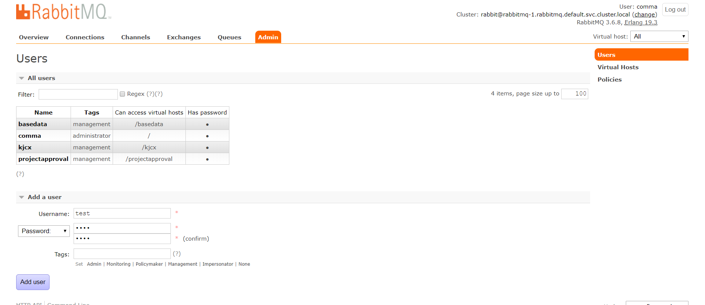
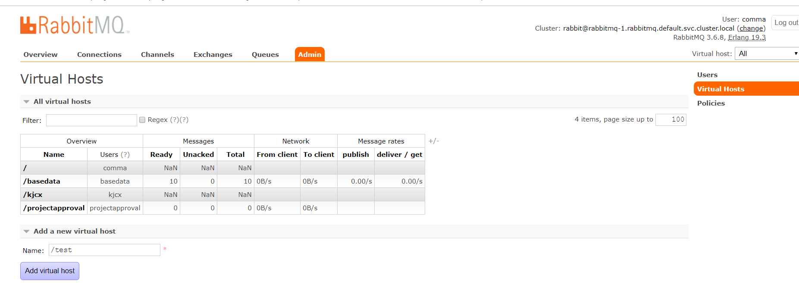
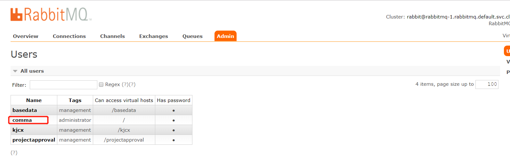
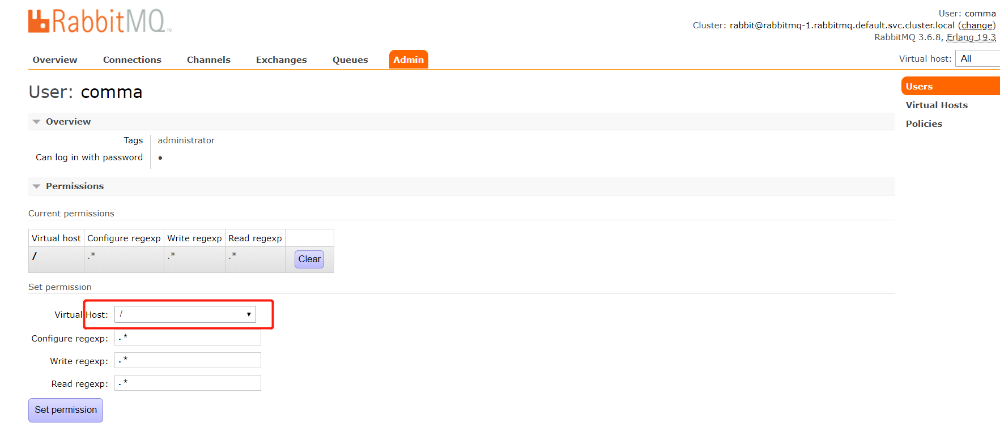

# RabbitMQ管理平台使用手册

 本文主要介绍RabbitMQ管理平台对MQ服务器中的user、virtualhost等的管理维护


## 管理平台访问地址

url:  http://****:****

username:  ****

password:  ****

## 用户管理

### 1.创建用户



在add a user栏目下：

username、password、confirm password直接录入即可

tags有 6个选项：

​	Admin | Monitoring | Policymaker | Management | Impersonator | None

#### RabbitMQ各类角色描述：

```
none
不能访问 management plugin

management
用户可以通过AMQP做的任何事外加：
列出自己可以通过AMQP登入的virtual hosts  
查看自己的virtual hosts中的queues, exchanges 和 bindings
查看和关闭自己的channels 和 connections
查看有关自己的virtual hosts的“全局”的统计信息，包含其他用户在这些virtual hosts中的活动。

policymaker 
management可以做的任何事外加：
查看、创建和删除自己的virtual hosts所属的policies和parameters

monitoring  
management可以做的任何事外加：
列出所有virtual hosts，包括他们不能登录的virtual hosts
查看其他用户的connections和channels
查看节点级别的数据如clustering和memory使用情况
查看真正的关于所有virtual hosts的全局的统计信息

administrator   
policymaker和monitoring可以做的任何事外加:
创建和删除virtual hosts
查看、创建和删除users
查看创建和删除permissions
关闭其他用户的connections
```

超级管理员用户(admin)直接给新建的用户分配management 即可。

### 2.创建virtual host



直接输入创建即可。

### 3.用户授权

点击用户进入用户详情，如下图



然后给该用户分配virtualhost



### 4.删除用户

在用户详情中，下拉页面会看到delete按钮，点击即可。

